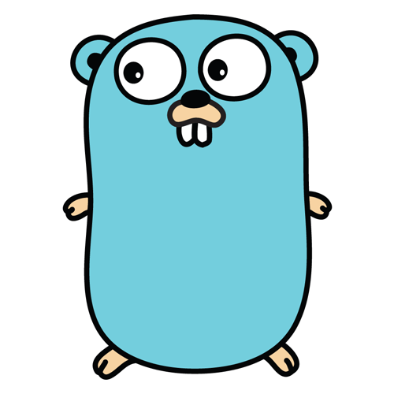

# **Módulo 1: Introdução ao Go - Características e Filosofia**

Esta aula introdutória apresenta a linguagem de programação Go (ou Golang), suas origens, os problemas que ela se propõe a resolver e suas principais características que a distinguem no cenário do desenvolvimento de software.

## 1\. A Origem e o Mascote

  * **O Mascote:** O "bichinho" da linguagem é um **Gopher**, não uma marmota. Ele foi desenhado por Renée French e se tornou um símbolo icônico e amigável da comunidade Go.
  * **A Criação:** Go foi concebida no **Google** por volta de 2007 e lançada como open-source em **2009**.
  * **Os Criadores:** Os nomes por trás da linguagem são gigantes da ciência da computação:
      * **Rob Pike:** Membro da equipe original do Unix e co-criador do UTF-8.
      * **Ken Thompson:** Co-criador do sistema operacional Unix e da linguagem de programação C.
      * **Robert Griesemer:** Trabalhou no V8 (motor JavaScript do Google) e em outros sistemas de compiladores.



## 2\. A Motivação: Por que Criar uma Nova Linguagem?

Os criadores estavam insatisfeitos com as linguagens dominantes na época para o desenvolvimento de sistemas no Google, principalmente C++. Os principais problemas que eles queriam resolver eram:

1.  **Lentidão na Compilação:** Grandes projetos em C++ levavam um tempo excessivo para compilar, reduzindo a produtividade.
2.  **Complexidade:** Linguagens como C++ e Java haviam acumulado uma quantidade enorme de *features* e complexidade sintática ao longo dos anos.
3.  **Gerenciamento de Concorrência:** Escrever código concorrente (que executa múltiplas tarefas "ao mesmo tempo") em outras linguagens era complexo, propenso a erros (deadlocks, race conditions) e não aproveitava bem os processadores multi-core modernos.

A filosofia do Go foi unir o melhor de dois mundos:

  * A **simplicidade e a produtividade** de linguagens dinamicamente tipadas como Python.
  * O **desempenho e a segurança** de linguagens estaticamente tipadas e compiladas como C++.

## 3\. Características Fundamentais do Go

  * **Open Source e Estaticamente Tipada:**

      * **Open Source:** O código-fonte da linguagem é aberto e mantido pela comunidade global, junto com o Google.
      * **Tipagem Estática:** O tipo de cada variável é verificado em tempo de compilação. Isso captura uma classe inteira de bugs antes mesmo de o programa rodar, resultando em software mais robusto e, muitas vezes, mais otimizado.

  * **Compilada para Binário Nativo (Sem Máquina Virtual):**

      * Esta é uma das vantagens mais significativas de Go. Diferente de Java (que roda na JVM) ou C\# (que roda no .NET), um programa Go é compilado para um **único arquivo executável** que não possui dependências externas.
      * **Vantagens:**
          * **Deployment Simplificado:** Para colocar uma aplicação em produção, basta copiar o arquivo binário para o servidor e executá-lo. Não é preciso instalar um *runtime* ou SDK na máquina de destino. Isso é ideal para contêineres (Docker).
          * **Inicialização Rápida:** Aplicações Go iniciam quase que instantaneamente, pois não há uma máquina virtual para ser carregada e aquecida. Isso é excelente para microsserviços e funções serverless.

  * **Concorrência como Cidadão de Primeira Classe:**

      * Go foi projetado desde o início para a era dos processadores multi-core. Ele oferece um modelo de concorrência baseado em **Goroutines** e **Channels**.
      * **Goroutines:** São "threads" extremamente leves, gerenciadas pelo próprio runtime do Go. É possível ter centenas de milhares ou até milhões de goroutines rodando simultaneamente.
      * **Channels:** São canais de comunicação tipados que permitem que as goroutines troquem dados de forma segura, evitando os problemas comuns de concorrência.
      * A filosofia é: *"Não se comunique compartilhando memória; em vez disso, compartilhe memória comunicando-se."*

  * **Biblioteca Padrão Abrangente (`stdlib`):**

      * Go vem com uma biblioteca padrão riquíssima, que permite construir aplicações complexas sem a necessidade de recorrer a pacotes de terceiros para tarefas comuns.
      * **Exemplos:** Servidores web (`net/http`), manipulação de JSON (`encoding/json`), criptografia (`crypto`), testes (`testing`), etc.

## 4\. Problemas que o Go Resolve (Casos de Uso)

Go brilha em cenários que exigem alto desempenho, concorrência e escalabilidade.

  * **Backend e APIs Web:** É uma das linguagens mais populares para a construção de microsserviços e APIs RESTful devido à sua performance e baixo consumo de memória.
  * **Ferramentas de Linha de Comando (CLI):** A compilação para um binário único torna Go perfeito para criar ferramentas de CLI que podem ser facilmente distribuídas.
  * **DevOps e Infraestrutura Cloud-Native:** Ferramentas como **Docker**, **Kubernetes** e **Terraform** são escritas em Go.
  * **Sistemas de Rede:** Seu suporte nativo à concorrência e sua excelente biblioteca `net` o tornam ideal para proxies, gateways e outros serviços de rede.
  * **Automação e Scripts:** Scripts de automação que precisam de performance e portabilidade são um ótimo caso de uso.


## 5\. Características Avançadas e Diferenciais (O "Go Way")

  * **Gerenciamento de Pacotes Descentralizado:** Originalmente, Go buscava pacotes diretamente de repositórios como o GitHub (`go get github.com/pacote/exemplo`). Hoje, o sistema evoluiu para os **Go Modules**, que fornecem um gerenciamento de dependências robusto e versionado, através dos arquivos `go.mod` e `go.sum`.

  * **Interfaces Implícitas (Duck Typing Estrutural):** Em Go, não é necessário declarar explicitamente que uma `struct` (similar a uma classe) implementa uma interface. Se a `struct` possui os métodos definidos pela interface, ela automaticamente satisfaz essa interface. Isso promove um acoplamento mais baixo e código mais flexível.

  * **Manipulação de Erro Explícita:** Go não usa o mecanismo de `try/catch` de outras linguagens. Em vez disso, as funções que podem falhar retornam o erro como um segundo valor. O código então verifica explicitamente se o erro é `nil` (nulo).

    ```go
    // Exemplo idiomático de tratamento de erro
    valor, err := algumaFuncaoQuePodeFalhar()
    if err != nil {
        // Lida com o erro aqui
        log.Fatal(err)
    }
    // Se chegou aqui, err é nil e 'valor' pode ser usado com segurança.
    ```

    Isso força o desenvolvedor a lidar com os erros de forma proativa, o que pode levar a um software mais resiliente.

  * **Suporte a Testes Integrado:** Go possui um framework de testes nativo no pacote `testing`. Basta criar um arquivo com o sufixo `_test.go` e escrever funções de teste. O ferramental da linguagem já sabe como encontrar e executar esses testes.

## 6\. Quem usa Go e Por Quê?

Além dos mencionados **Google**, **Twitch**, **Twitter** e **Mercado Livre**, gigantes como **Uber**, **Dropbox**, **Salesforce** e muitos outros migraram ou adotaram Go para seus sistemas críticos.

**Principal Ganho para as Empresas:** **Eficiência**.

  * **Eficiência de Desempenho:** Aplicações mais rápidas e que respondem melhor.
  * **Eficiência de Recursos:** Menor consumo de CPU e memória, o que se traduz diretamente em **menor custo com servidores e infraestrutura na nuvem**.
  * **Eficiência de Desenvolvimento:** A simplicidade da linguagem e a compilação rápida aumentam a produtividade dos desenvolvedores.